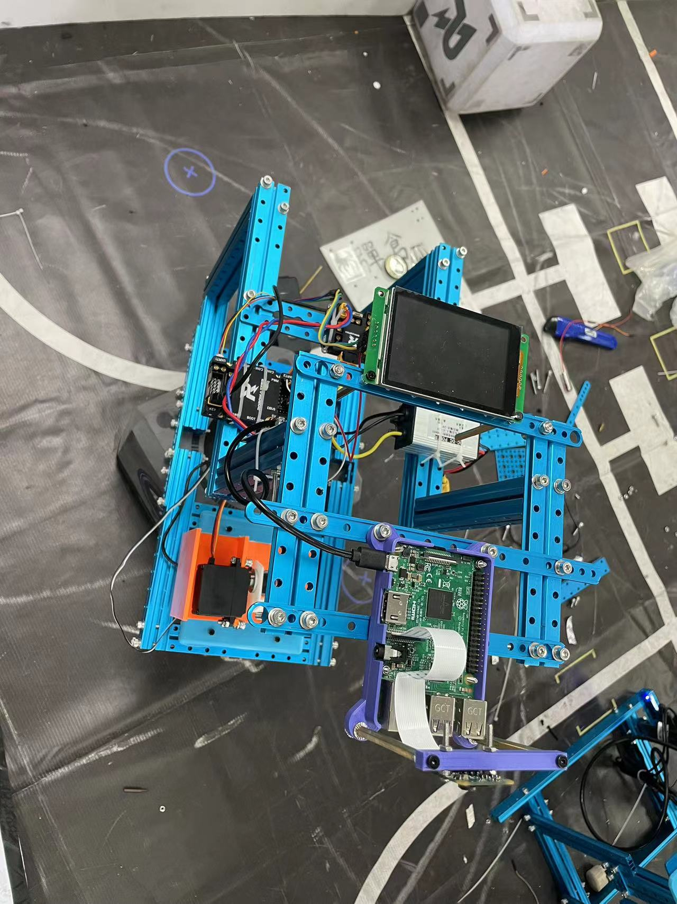
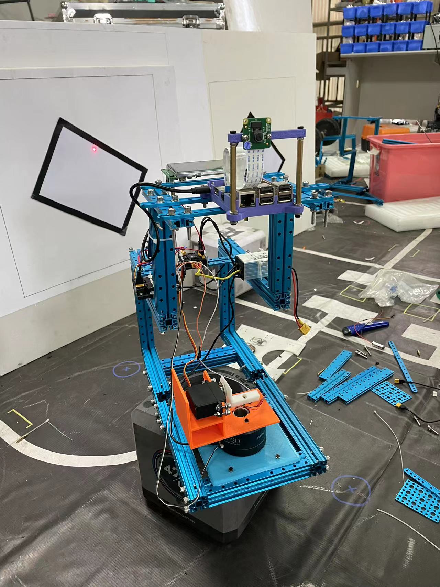

# 2023 电赛 E 题视觉方案

重庆市一等奖第二名，没推国赛因为测试的时候红色激光寄了，临时换的激光笔规格不一样，跟云台有干扰，部分小题直接零分

## 硬件方案

- 云台部分：3D 打印云台支架，GM6020 云台电机，DS3115 舵机
- 控制部分：RoboMaster 开发版 C 型
- 视觉部分：Raspberry Pi 3 Model B

    
    

## 视觉方案

### 整体框架

- 串口屏向 C 板发送执行任务信号，C 板向树莓派发送信号，树莓派接收信号执行任务
- 树莓派每处理一帧图像向 C 板发送一次信号（当前点坐标与目标点坐标），优化后整体速度可以接近 30 fps （相机极限）
- C 板接收树莓派信号后转化为误差，pid 控制云台运动
- 串口屏发送暂停信号，C 板停止向树莓派发送信号，实现暂停功能

### 基本部分

1. 树莓派上电自启动，通过简单自适应阈值二值化与形态学操作找到铅笔框大致位置，截取 roi ，
2. 在 roi 中通过角点检测 `cv.goodFeaturesToTrack` 搜索 `screen` 的四个顶点，并规划激光经过的所有路径点
   - 上电后视觉部分与屏幕的相对位置不能改变
   - 程序会先做一次初始化，进行 roi 的截取和铅笔框的检测，初始化过程中铅笔框中不能有 A4 纸黑框
3. 使用 hsv 阈值查找激光点
4. 通过 `screen` 的四个角点确定中心点，目标点为中心点不变实现复位
5. 使用简单二值化搜索 A4 纸黑框，确定四个顶点后规划路径点
6. 使用 `trace` 函数控制激光点逐个经过路径点实现各项任务

### 发挥部分

1. 使用 hsv 阈值查找红绿激光点
2. 目标点为红色激光点，控制点为绿色激光点，实现跟随
   - 两个激光点重合会变成黄色，实际测试影响不大
   - 激光点可能会因为电工胶、距离或光照等因素无法识别，实际可以自行微调对应阈值参数 `vision.find_red_pt`

